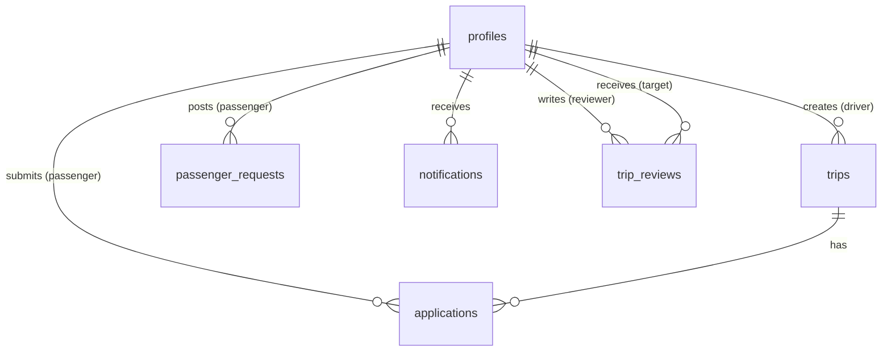
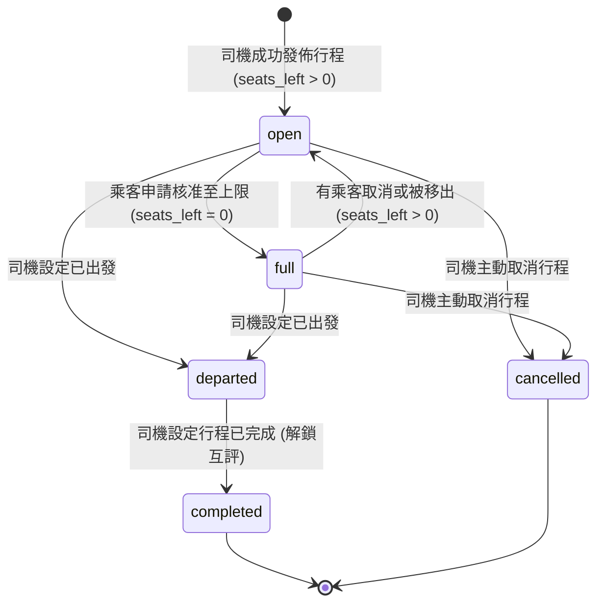
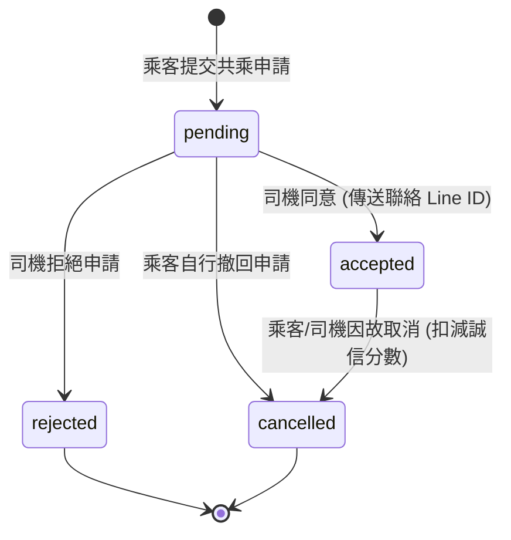

# Surfpool 衝浪共乘平台 - 系統功能與技術規格書 (System Specification)

本規格書旨在詳細說明「Surfpool 衝浪共乘平台」的系統架構、資料庫設計、功能模組、業務邏輯與安全防護策略。

---

## 1. 專案簡介 (Project Overview)

### 1.1 背景與痛點
衝浪運動（Surfing）在台灣日益普及，但衝浪點（如宜蘭烏石港、雙獅、台東東河、佳樂水等）多位於偏遠海岸，交通不便。衝浪者面臨以下痛點：
1. **交通成本高**：單人開車往返油資與過路費高昂。
2. **攜板限制**：大眾運輸工具對衝浪板（長板、短板）有嚴格的長度與攜帶限制。
3. **資訊不對稱**：想搭車的乘客（浪人）與有空位且車頂可載板的司機（有車浪人）之間缺乏專屬的媒合平台。

### 1.2 專案目標
「Surfpool」是一個專為衝浪者設計的**共乘媒合平台**。本專案透過 Web 應用程式，串接後端資料庫，提供：
- 司機「發佈行程」（開團）與乘客「尋找行程」（跟團）的雙向媒合。
- 針對**衝浪板載運能力**（長短板數量、載板位置）的特殊篩選機制。
- 保護隱私的聯絡機制（審核通過後才顯示 Line ID 與精確集合地點）。
- 雙向評價機制，維護共乘社群的安全與品質。

---

## 2. 技術架構 (Technology Stack)

本專案採用現代 Web 開發技術棧，以輕量、即時、響應式為核心：

| 技術層級 | 採用技術 / 套件 | 說明 |
| :--- | :--- | :--- |
| **Frontend Framework** | **Next.js 16 (App Router)** | 提供高效的 React 伺服器/用戶端元件渲染，以及靈活的 Routing 系統。 |
| **Language** | **TypeScript** | 確保前端型別安全，降低維護成本與潛在 Bug。 |
| **Styling & CSS** | **Tailwind CSS v4 & PostCSS** | 用於響應式與現代化 UI 樣式開發，支援 Mobile-First 行動端優先設計。 |
| **Backend Service** | **Supabase** | Backend-as-a-Service (BaaS)，提供身份驗證、PostgreSQL 資料庫及即時數據庫連線。 |
| **Database** | **PostgreSQL (Supabase)** | 存儲結構化業務數據，利用內建的 PostgreSQL 觸發器與安全政策。 |
| **Security** | **Row Level Security (RLS)** | 在資料庫層直接對資料讀寫進行權限控管，防範越權存取。 |
| **Authentication** | **Google OAuth (Supabase Auth)** | 簡化登入流程，提升使用者便利性與安全性。 |

---

## 3. 資料庫設計 (Database Schema Design)

資料庫採用 PostgreSQL，設計了 6 張主要資料表及 5 個自訂 Enum 型別。



### 3.1 自訂 Enum 型別

1. **`trip_status`** (共乘行程狀態)
   - `'open'` (開放共乘)：司機已發車，尚有空位，接受申請中。
   - `'full'` (已額滿)：人數已達上限，暫不接受新申請。
   - `'departed'` (已出發)：行程已開始前往目的地。
   - `'completed'` (已完成)：行程順利結束，可進行互評。
   - `'cancelled'` (已取消)：行程因故取消。

2. **`board_type`** (衝浪板攜帶型別)
   - `'none'` (無板)：乘客不攜帶衝浪板。
   - `'short'` (短板)：乘客攜帶短板 (Shortboard)。
   - `'long'` (長板)：乘客攜帶長板 (Longboard)。

3. **`application_status`** (共乘申請狀態)
   - `'pending'` (審核中)：乘客已送出申請，等待司機確認。
   - `'accepted'` (已接受)：司機同意申請，乘客取得聯繫資訊。
   - `'rejected'` (已拒絕)：司機拒絕該筆申請。
   - `'cancelled'` (已取消)：乘客主動取消申請。

4. **`request_status`** (尋車需求狀態)
   - `'searching'` (尋找中)：乘客發佈徵車需求。
   - `'matched'` (已媒合)：乘客已找到適合的共乘行程。
   - `'cancelled'` (已取消)：乘客取消尋車需求。
   - `'expired'` (已過期)：出發日期已過但未媒合成功。

5. **`notification_type`** (通知類別)
   - `'info'` (一般資訊)：如行程狀態變更。
   - `'action'` (操作關聯)：如收到共乘申請、收到行程邀請。
   - `'alert'` (警告提醒)：如行程被取消。

---

### 3.2 資料表設計 (Tables Schema)

#### 1. `profiles` (使用者個人檔案)
與 Supabase `auth.users` 進行一對一關聯，同步使用者基本資訊及信譽統計。

| 欄位名稱 | 型別 | 條件限制 | 說明 |
| :--- | :--- | :--- | :--- |
| `id` | UUID | PRIMARY KEY, REFERENCES auth.users(id) ON DELETE CASCADE | 使用者唯一識別碼 (與 Auth 連動) |
| `display_name` | TEXT | NOT NULL | 顯示名稱 / 暱稱 |
| `rating` | NUMERIC | DEFAULT 0 | 歷史平均評價星等 (1 - 5) |
| `completed_trips`| INTEGER | DEFAULT 0 | 累計已完成行程數 |
| `cancellations_90d`| INTEGER | DEFAULT 0 | 過去 90 天內的取消行程次數 (誠信指標) |
| `line_id` | TEXT | | Line 通訊軟體聯絡 ID |
| `created_at` | TIMESTAMPTZ| DEFAULT now() | 帳號建立時間 |

#### 2. `trips` (司機開團行程表)
記錄司機發佈的共乘行程資訊。

| 欄位名稱 | 型別 | 條件限制 | 說明 |
| :--- | :--- | :--- | :--- |
| `id` | UUID | PRIMARY KEY, DEFAULT gen_random_uuid() | 行程唯一識別碼 |
| `driver_id` | UUID | NOT NULL, REFERENCES profiles(id) ON DELETE CASCADE | 司機使用者 ID |
| `driver` | TEXT | NOT NULL | 司機顯示名稱 (冗餘欄位以加速查詢) |
| `rating` | NUMERIC | DEFAULT 0 | 發佈時司機的評等 |
| `completed_trips`| INTEGER | DEFAULT 0 | 發佈時司機完成行程數 |
| `cancellations_90d`| INTEGER | DEFAULT 0 | 發佈時司機 90 天內取消數 |
| `date` | DATE | NOT NULL | 出發日期 |
| `destination` | TEXT | NOT NULL | 衝浪點目的地 (對照 `surfSpots`) |
| `departure_area` | TEXT | NOT NULL | 出發地區 (如：台北市大安區) |
| `departure_time` | TEXT | NOT NULL | 出發時間 (包含精確時間與彈性說明) |
| `return_time` | TEXT | NOT NULL | 回程時間 (包含時間或「現場討論」等備註) |
| `trip_type` | TEXT | NOT NULL | 行程類型 (去回程、只去程) |
| `route` | TEXT | NOT NULL | 預計路線規劃說明 |
| `pickup_mode` | TEXT | NOT NULL | 接送模式 (沿路可接、固定集合) |
| `seats_left` | INTEGER | NOT NULL | 剩餘可用座位數 |
| `max_passengers` | INTEGER | NOT NULL | 行程最大載客數上限 |
| `shortboards` | INTEGER | NOT NULL | 可載短板最大上限數 |
| `longboards` | INTEGER | NOT NULL | 可載長板最大上限數 |
| `board_location` | TEXT | NOT NULL | 衝浪板放置位置 (車頂架、車內、都可、無需載板) |
| `price` | INTEGER | NOT NULL | 共乘分攤金額 (TWD) |
| `status` | `trip_status`| DEFAULT 'open' | 目前行程狀態 |
| `rules` | TEXT[] | DEFAULT '{}' | 共乘守則 / 備註 (如：不吃東西、濕衣不上車) |
| `note` | TEXT | | 司機補充備註 |
| `exact_pickup` | TEXT | | 精確集合地點 (審核通過之乘客專屬可見) |
| `line_id` | TEXT | | 司機 Line ID (審核通過之乘客專屬可見) |
| `created_at` | TIMESTAMPTZ| DEFAULT now() | 建立時間 |

#### 3. `applications` (乘客共乘申請表)
記錄乘客針對特定行程送出的共乘申請。

| 欄位名稱 | 型別 | 條件限制 | 說明 |
| :--- | :--- | :--- | :--- |
| `id` | UUID | PRIMARY KEY, DEFAULT gen_random_uuid() | 申請唯一識別碼 |
| `trip_id` | UUID | NOT NULL, REFERENCES trips(id) ON DELETE CASCADE | 申請的行程 ID |
| `passenger_id` | UUID | NOT NULL, REFERENCES profiles(id) ON DELETE CASCADE | 乘客使用者 ID |
| `passenger` | TEXT | NOT NULL | 乘客顯示名稱 |
| `pickup_area` | TEXT | NOT NULL | 希望上車的地點/區域 |
| `board` | `board_type`| DEFAULT 'none' | 攜帶衝浪板類型 |
| `line_id` | TEXT | NOT NULL | 乘客聯絡 Line ID (審核通過之司機專屬可見) |
| `note` | TEXT | | 乘客給司機的備註 |
| `status` | `application_status` | DEFAULT 'pending' | 目前申請狀態 |
| `created_at` | TIMESTAMPTZ| DEFAULT now() | 申請送出時間 |

#### 4. `passenger_requests` (乘客尋車/徵車需求表)
當乘客找不到合適的行程時，可以主動發佈自己的尋車需求。

| 欄位名稱 | 型別 | 條件限制 | 說明 |
| :--- | :--- | :--- | :--- |
| `id` | UUID | PRIMARY KEY, DEFAULT gen_random_uuid() | 需求唯一識別碼 |
| `passenger_id` | UUID | NOT NULL, REFERENCES profiles(id) ON DELETE CASCADE | 乘客使用者 ID |
| `passenger` | TEXT | NOT NULL | 乘客顯示名稱 |
| `rating` | NUMERIC | DEFAULT 0 | 乘客評等 |
| `completed_trips`| INTEGER | DEFAULT 0 | 乘客已完成行程數 |
| `cancellations_90d`| INTEGER | DEFAULT 0 | 乘客 90 天內取消次數 |
| `date` | DATE | NOT NULL | 期望出發日期 |
| `destination` | TEXT | NOT NULL | 期望衝浪目的地 |
| `departure_area` | TEXT | NOT NULL | 期望出發地區 |
| `route_flexibility`| TEXT | NOT NULL | 路線彈性說明 (例如：捷運站沿線皆可) |
| `trip_type` | TEXT | NOT NULL | 期望類型 (去回程、只去程) |
| `outbound_time` | TEXT | NOT NULL | 期望去程出發時間 |
| `return_time` | TEXT | NOT NULL | 期望回程出發時間 |
| `board` | `board_type`| DEFAULT 'none' | 攜帶板型 |
| `acceptable_price`| INTEGER | NOT NULL | 可接受最高分攤金額 |
| `line_id` | TEXT | NOT NULL | 乘客 Line ID (接受邀請的司機專屬可見) |
| `note` | TEXT | | 其他備註需求 |
| `status` | `request_status`| DEFAULT 'searching' | 目前徵車狀態 |
| `created_at` | TIMESTAMPTZ| DEFAULT now() | 發佈時間 |

#### 5. `notifications` (系統通知表)
存放發送給使用者的各類系統動態通知。

| 欄位名稱 | 型別 | 條件限制 | 說明 |
| :--- | :--- | :--- | :--- |
| `id` | UUID | PRIMARY KEY, DEFAULT gen_random_uuid() | 通知唯一識別碼 |
| `user_id` | UUID | NOT NULL, REFERENCES profiles(id) ON DELETE CASCADE | 接收通知的使用者 ID |
| `text` | TEXT | NOT NULL | 通知內文 |
| `type` | `notification_type`| DEFAULT 'info' | 通知類型 |
| `read` | BOOLEAN | DEFAULT false | 是否已讀 |
| `created_at` | TIMESTAMPTZ| DEFAULT now() | 通知時間 |

#### 6. `trip_reviews` (共乘評價表)
記錄行程結束後，使用者之間的雙向互評。

| 欄位名稱 | 型別 | 條件限制 | 說明 |
| :--- | :--- | :--- | :--- |
| `id` | UUID | PRIMARY KEY, DEFAULT gen_random_uuid() | 評價唯一識別碼 |
| `reviewer_id` | UUID | NOT NULL, REFERENCES profiles(id) ON DELETE CASCADE | 評價撰寫者 ID |
| `target_id` | UUID | NOT NULL, REFERENCES profiles(id) ON DELETE CASCADE | 被評價對象 ID |
| `target_name` | TEXT | NOT NULL | 被評價對象顯示名稱 |
| `trip_date` | DATE | NOT NULL | 關聯行程日期 |
| `trip_destination`| TEXT | NOT NULL | 關聯行程目的地 |
| `rating` | INTEGER | NOT NULL, CHECK (rating >= 1 AND rating <= 5) | 星等 (1 - 5 分) |
| `text` | TEXT | | 詳細評價評語 |
| `created_at` | TIMESTAMPTZ| DEFAULT now() | 評價時間 |

---

### 3.3 安全防護：Row Level Security (RLS) 政策

為了保護衝浪者的聯絡隱私與個人資料，Supabase 開啟了 **Row Level Security (RLS)** 防護政策：

1. **`profiles` (使用者個人檔案)**:
   - **讀取 (SELECT)**：允許所有已認證用戶檢視基本資訊 (Public profiles are viewable by everyone)。
   - **寫入與更新 (INSERT / UPDATE)**：僅限當前登入者操作與其自己 `id` 相符的 Profile。

2. **`trips` (共乘行程表)**:
   - **讀取 (SELECT)**：所有人可讀取，但前端與後端控制「聯絡資訊 (Line ID)」與「精確集合點 (exact_pickup)」在未獲審核通過時為隱藏。
   - **寫入、更新與刪除 (INSERT / UPDATE / DELETE)**：僅限當前行程的司機 (`auth.uid() = driver_id`) 進行變更。

3. **`applications` (共乘申請表)**:
   - **讀取 (SELECT)**：僅限該申請乘客本人 (`passenger_id`) 以及該行程的開團司機可以檢視，防止旁人獲取 Line ID 等個資。
   - **寫入 (INSERT)**：僅限當前登入者自己作為乘客申請。
   - **更新 (UPDATE)**：僅限該乘客 (取消申請) 或該司機 (同意/拒絕申請)。

4. **`passenger_requests` (乘客尋車需求表)**:
   - **讀取 (SELECT)**：所有人均可讀取需求列表，以便司機尋找適合的乘客。
   - **寫入、更新與刪除 (INSERT / UPDATE / DELETE)**：僅限該乘客本人 (`auth.uid() = passenger_id`)。

5. **`notifications` (系統通知表)**:
   - **讀取與更新 (SELECT / UPDATE)**：僅限該通知的接收人本人 (`auth.uid() = user_id`)。

6. **`trip_reviews` (共乘評價表)**:
   - **讀取 (SELECT)**：所有人可讀取評價以維護信譽機制。
   - **寫入 (INSERT)**：僅限評價撰寫者本人 (`auth.uid() = reviewer_id`)。

---

## 4. 系統功能模組與 UI 流程 (System Functional Modules & UI Flows)

系統採用 Single Page Application (SPA) 的多頁籤架構，主要包含 4 個頁籤及多個覆蓋互動工作面板 (Sheets)。

```
[使用者入口] -> [Google 登入] -> [首頁/工作區]
                                 |
        +------------------------+------------------------+
        |                        |                        |
     [ 找車 ]                 [ 我的行程 ]              [ 個人 ]
        |                        |                        |
     - 篩選衝浪點              司機端：                  - 個人基本誠信值
     - 司機發車列表             - 編輯/取消/完成行程      - 歷史評價清單
     - 乘客需求列表             - 審核乘客申請表         - 登出按鈕
     - 申請共乘 (Apply)        乘客端：
     - 司機邀請 (Invite)        - 查看已接受行程 Line ID
                               - 填寫互評星等
```

### 4.1 身份驗證與入口模組 (Auth Module)
1. **Google OAuth 登入**：
   - 未登入用戶會被導向至「Login Screen」，點擊「以 Google 帳號登入」後，跳轉至 Google 授權頁。
2. **登入回呼 (Auth Callback Handler)**：
   - 登入成功後，Supabase Auth 觸發 `onAuthStateChange` 並重導向回 `/auth-callback`。
   - 檢查使用者是否首次登入，若是，則引導至建立個人 Profile（設定 `display_name` 與 `line_id`）。
   - 完成後進入系統首頁。

### 4.2 找車與搜尋模組 (Find Module)
為首頁預設頁籤，支援雙向搜尋：

#### 司機行程列表 (Trips Tab)
1. **多條件篩選**：
   - 出發日期 (Date)。
   - 目的地 (Destination) - 包含台灣各大衝浪熱點的 Dropdown 清單。
   - 出發地區 (Departure Area)。
   - 衝浪板限制 (支援長板/短板過濾，系統會比對車輛的可容納長短板額度)。
2. **申請共乘**：
   - 點擊行程開啟詳細卡片，檢視司機評價、誠信紀錄、車頂置板位置、分攤價格。
   - 點擊「申請共乘」開啟 `ApplySheet`，需填寫：希望上車地點、攜帶板型（無/短/長）、Line ID 與備註，送出後狀態轉為 `pending`。
3. **收藏行程**：
   - 點擊心形按鈕可隨時收藏行程，於「我的行程」中追蹤。

#### 乘客需求列表 (Requests Tab)
1. **查看徵車浪人**：
   - 司機可在此切換至「乘客需求」列表，查看哪些浪人今天需要搭車。
2. **主動發出邀請 (Invite)**：
   - 若司機本身已建立同一天、同一方向的行程，且車上還有空位與載板額度，可在該乘客卡片點選「邀請加入」。
   - 系統將發送通知給乘客。

---

### 4.3 行程管理模組 (My Trips Module)
管理當前使用者所有相關行程，根據角色不同展現不同工作流：

#### A. 司機工作流 (Driver Workflow)
1. **發布新行程 (Create Trip)**：
   - 點選右下角 `+` 按鈕開啟 `CreateTripSheet`。
   - 填寫行程細節（出發地、目的地、出發/回程時間、價格、座位數、長短板剩餘空間等）並發布。
2. **審核申請人 (Manage Applications)**：
   - 在行程卡片下，司機可即時檢視所有收到乘客的 `pending` 申請。
   - 點擊「同意」會開啟 `RevealSheet`，司機需補充填寫「精確集合地點」與「Line ID」，點擊送出後將狀態轉為 `accepted`。
   - 點擊「拒絕」則將狀態轉為 `rejected`。
3. **行程出發與完成**：
   - 出發時，可變更狀態為 `departed`。
   - 抵達並順利共乘結束後，司機點擊「完成行程」。狀態轉為 `completed`，並開啟對每位乘客的 `RatingSheet`（評分 1-5 星與填寫評語）。

#### B. 乘客工作流 (Passenger Workflow)
1. **管理我的申請**：
   - 檢視已送出的共乘申請。若狀態為 `pending`，可隨時「取消申請」。
2. **聯絡司機**：
   - 當申請狀態更新為 `accepted` 時，該卡片會解鎖「查看司機資訊」功能。點擊打開 `RevealSheet` 即可取得司機的 Line ID 與精確集合地點。
3. **主動發佈尋車需求 (Create Request)**：
   - 點選右下角 `+` 按鈕發佈自己的乘車時間與衝浪板尺寸，等待有緣的司機邀請。
4. **行程結束與評價**：
   - 司機將行程標註為「已完成」後，乘客的行程卡片將解鎖「評價司機」按鈕，引導進入評分系統。

---

### 4.4 通知與設定模組 (Notification & Profile Module)
1. **通知 (Notifications)**：
   - 當申請被接受/拒絕、或收到司機的行程邀請時，系統會建立一筆 `notifications`。
   - 使用者在通知頁籤可一鍵標記為已讀。
2. **個人檔案 (Profile)**：
   - 展示使用者的公開信譽。
   - 誠信儀表板：顯示過去 90 天內的取消次數 (Cancellations) 與已完成次數。
   - 收到的評價：以時間軸排列顯示其他浪人留下的評價星等與評語文字。

---

## 5. 核心業務狀態流轉圖 (State Machines)

### 5.1 行程狀態流轉 (`trip_status`)



### 5.2 乘客共乘申請狀態流轉 (`application_status`)



---

## 6. 非功能性需求與技術規範 (Non-Functional Requirements)

1. **行動端優先適應 (Mobile-First Design)**：
   - 考慮到浪人常常在海灘、車上、戶外使用手機檢視行程，整個介面使用移動端優化佈局，寬度鎖定在 Max-Width 480px 的卡片流式設計。
2. **個資安全防範 (Data Privacy)**：
   - 未經配對成功（即申請狀態非 `accepted`）之前，任何用戶皆無法透過前端 API 或資料庫直接查詢到他人的 Line ID 與精細地址。
3. **自動狀態清理 (Automated Cleanup)**：
   - 當行程日期過期時，系統應於載入時將狀態標記為過期或唯讀，避免過期資訊干擾使用者媒合。
4. **防刷信譽機制 (Reputation Guard)**：
   - 使用者一旦「接受後取消」將會記錄於 `cancellations_90d` 內，該指數會直接顯示在個人資訊與行程列表中，警示其他用戶。

---
*本規格書所涵蓋之欄位與邏輯，已完全落實於 `schema.sql`、`types.ts` 與首頁核心邏輯 `page.tsx` 中。*
